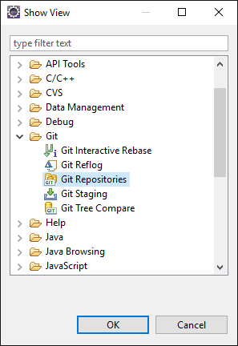
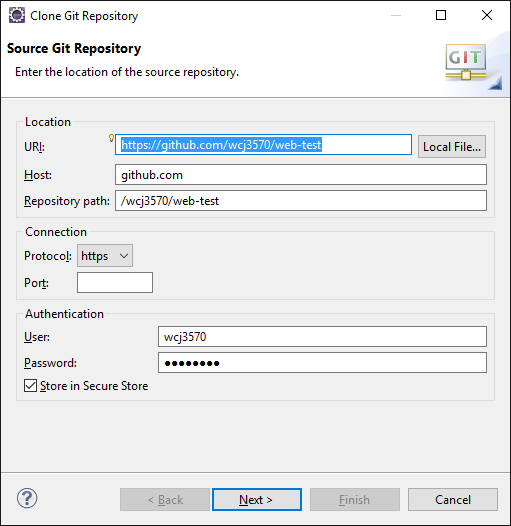
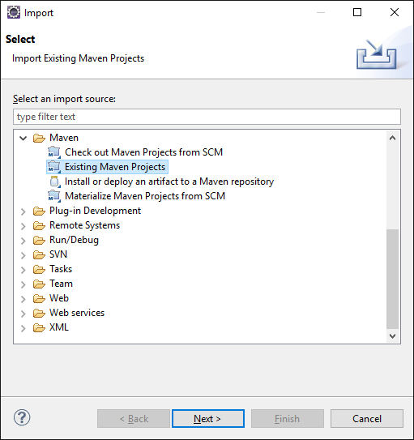
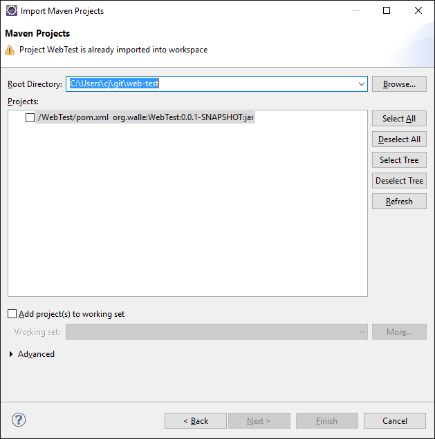
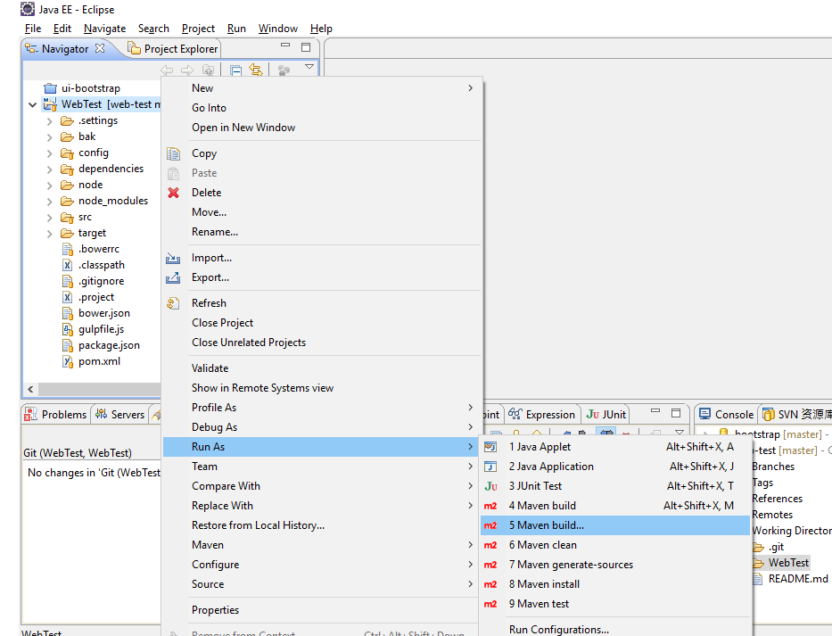
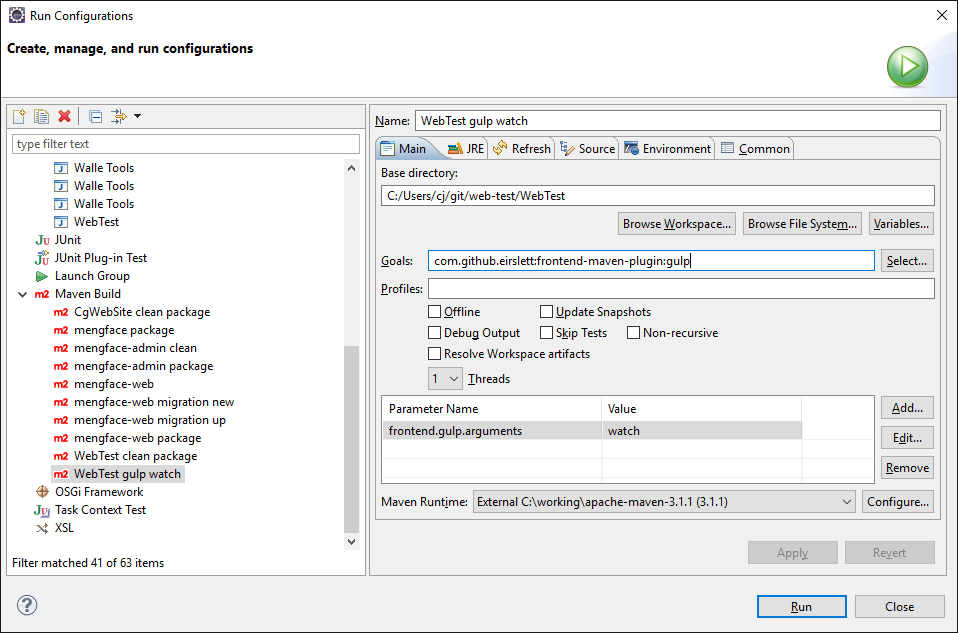

# Eclipse + Github + Maven project setup

- In Eclipse, show view Git Repositories

 

- Click Clone button in Git Repositories view

 

- Input URI: https://github.com/wcj3570/web-test.git , and your user/pass

 

- Import project

 

 

 

- Install walle jars, goto [UserFolder]/git/web-test/dependencies, run
 ```bat
 install.bat
 ```
- Build project. Run as -> Maven build, Goals: `clean package -DskipTests`

 

 

- Run gulp watch when developing. Run as -> Maven build, Goals: `com.github.eirslett:frontend-maven-plugin:gulp`, with a Parameter `frontend.gulp.arguments = watch`

 

- Run as Java Application, Main class `org.walle.webtest.Application`

 

- Visit [http://localhost:8080](http://localhost:8080)

